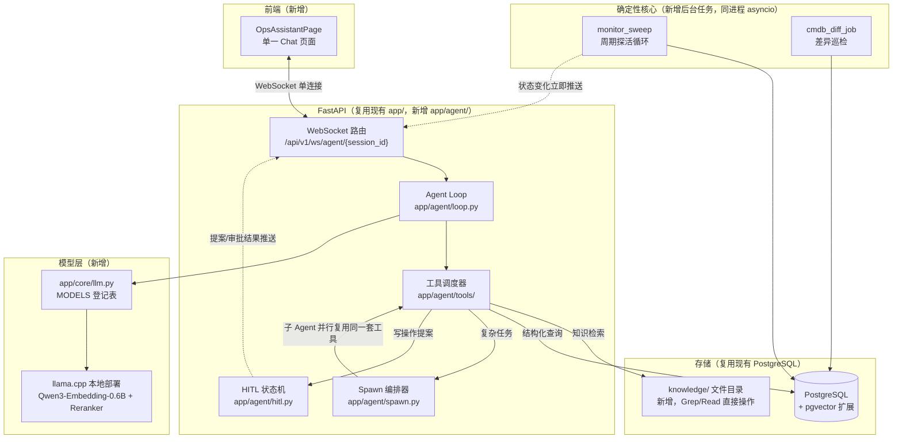
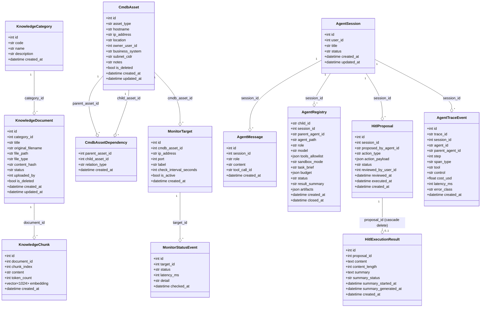
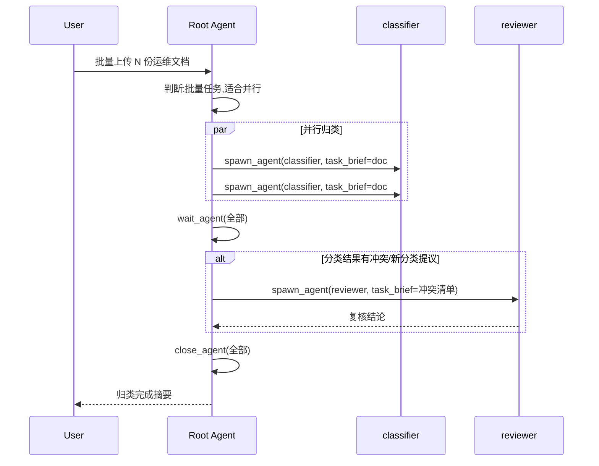
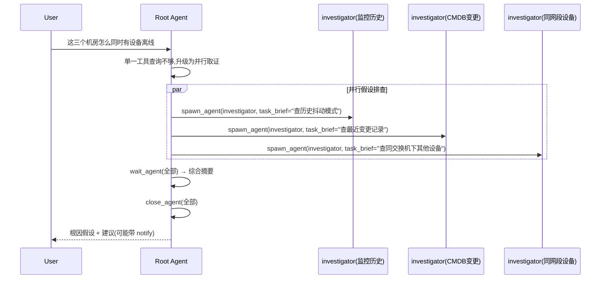
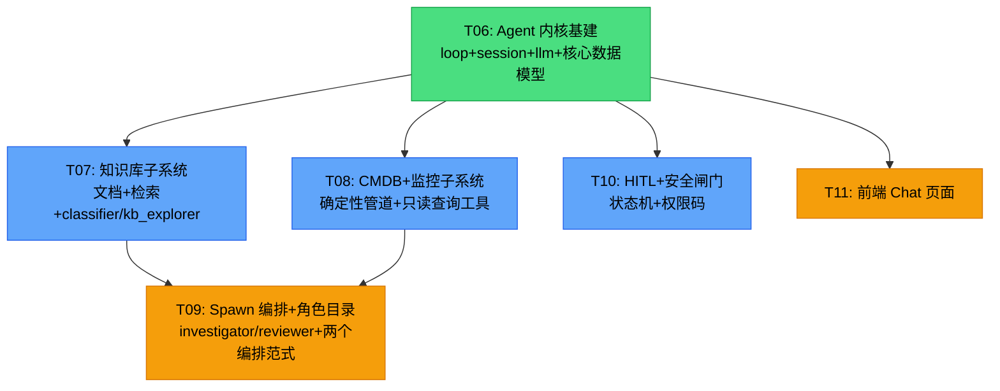

# 运维 Agent 平台 — 架构设计文档

> **项目名称**: ent-agent(基于 fastapi-admin RBAC 基座的二次开发)
> **文档版本**: v1.0
> **撰写人**: 李剑桥
> **日期**: 2026-08-10
> **基于**: [docs/ARCHITECTURE.md](./ARCHITECTURE.md)（RBAC 基座 v1.1）+ [docs/guide.md](./guide.md)（Agent 开发范式手册 2026-08，本文档不修改该文件，仅作为技术路线参照）

---

## 目录

- [运维 Agent 平台 — 架构设计文档](#运维-agent-平台--架构设计文档)
  - [目录](#目录)
  - [Part A: 系统设计](#part-a-系统设计)
    - [1. 需求背景与产品定位](#1-需求背景与产品定位)
    - [2. 总体架构](#2-总体架构)
    - [3. 数据模型](#3-数据模型)
    - [4. Agent 角色目录与工具契约](#4-agent-角色目录与工具契约)
      - [4.1 角色目录](#41-角色目录)
      - [4.2 工具契约](#42-工具契约)
    - [5. 动态 Spawn 编排](#5-动态-spawn-编排)
    - [6. HITL 状态机](#6-hitl-状态机)
    - [7. 确定性管道](#7-确定性管道)
    - [8. 会话、压缩与前端实时通道](#8-会话压缩与前端实时通道)
    - [9. 安全基线映射（L0–L6）](#9-安全基线映射l0l6)
    - [10. 可观测性与预算](#10-可观测性与预算)
    - [11. 待明确事项与假设](#11-待明确事项与假设)
  - [Part B: 任务分解](#part-b-任务分解)
    - [12. 新增依赖](#12-新增依赖)
    - [13. 任务列表（延续 T01–T05 编号）](#13-任务列表延续-t01t05-编号)
    - [14. 任务依赖图](#14-任务依赖图)

---

## Part A: 系统设计

### 1. 需求背景与产品定位

在现有 RBAC 后台（[ARCHITECTURE.md](./ARCHITECTURE.md)）之上，新增一个**统一运维助手**：一个 Chat 页面，融合三类能力——

1. **运维知识问答**：上传 SOP/故障处理手册/网络拓扑说明/厂商手册，Agent 用混合检索（Grep 优先，向量补充）回答
2. **设备/网段在线状态查询**：基于常驻后台探活管道的实时数据回答
3. **CMDB 关联查询与根因排查**：把"资产归属/依赖关系"和"实时状态"接起来，回答需要综合判断的问题

产品形态与技术路线取舍已在讨论中确定，不再展开决策过程，直接进入设计。核心取向对齐 [guide.md 1.4](./guide.md#14-2026-共识取向)：

- **简单查询走单体 Agent 循环**（一次工具调用），**只有需要并行取证/独立上下文降噪时才 spawn**（guide.md 7.1、7.8 反模式）
- 网段探活、CMDB 差异巡检是**确定性管道**，不是 Agent（guide.md 1.3）
- Agent 只在"融合多路数据源做判断"和"问答"这两类事情上出现

### 2. 总体架构



**分层约束**（延续 [ARCHITECTURE.md 8.1](./ARCHITECTURE.md#81-后端编码规范) 的"禁止跨层调用"）：`app/agent/` 内的工具实现只能调用 `app/crud/`，不得绕过 CRUD 层直接拼 SQL；`app/agent/` 与 `app/api/`、`app/crud/`、`app/models/`、`app/services/` 平级，是新增的第五个顶层分层。

**不引入新中间件**：不加 Redis/消息队列，不加独立向量库，pgvector 作为 Postgres 扩展开启；子 Agent 并发用进程内 `asyncio` 任务实现（后续需要跨进程扩容时，可替换执行器实现，注册表接口不变）。

### 3. 数据模型



**设计说明：**

| 决定                                                                                                                                       | 理由                                                                                                                        |
| :----------------------------------------------------------------------------------------------------------------------------------------- | :-------------------------------------------------------------------------------------------------------------------------- |
| `KnowledgeDocument` 只存元数据，正文落盘到 `knowledge/{category_code}/{doc_id}_{filename}`                                                 | 对齐 [guide.md 4.3](./guide.md#43-知识落盘纪律)；`kb_grep`/`kb_glob`/`kb_read` 直接操作文件系统                             |
| `KnowledgeChunk.embedding` 用 `vector(1024)`（pgvector）                                                                                   | 对应本地 llama.cpp 部署的 Qwen3-Embedding-0.6B 原生输出维度；实测不符可调整列定义                                           |
| `CmdbAssetDependency` 只有外键 + `created_at`，无自增 id                                                                                   | 沿用 [ARCHITECTURE.md 8.4](./ARCHITECTURE.md#84-数据库约定) 关联表约定（同 `UserRole`/`RolePermission`）                    |
| 不单独建"当前状态"可变字段，设备在线状态永远从 `MonitorStatusEvent` 最新一条**派生**（`DISTINCT ON (target_id) ORDER BY checked_at DESC`） | 避免"事件表"和"当前状态表"两份状态互相漂移，对应 [guide.md 3.1](./guide.md#31-确定性核心-vs-模型边缘)"审计字段代码派生"原则 |
| CMDB 变更记录、知识文档归类结果、CMDB↔监控差异巡检发现，**全部复用现有 `audit_logs` 表**，不新建审计表                                     | 现有 `utils.audit.log_audit()` 已经是通用工具；新增 `action` 枚举值即可，避免重复造轮子                                     |
| `AgentRegistry` 就是 [guide.md 7.4](./guide.md#74-childreceipt每次-spawn-必有回执) 的 `ChildReceipt` 落地为表                              | 注册表必须能在压缩/断线后独立查询，不依赖对话正文（guide.md 6.3）                                                           |
| `AgentTraceEvent` 字段直接照抄 [guide.md 8.3](./guide.md#83-日志字段建议)                                                                  | 保证"卡在哪一步"可回答                                                                                                      |
| `HitlExecutionResult` 以 `proposal_id` 唯一关联 `device_query`，正文与总结状态独立于 `action_payload`                                      | 完整设备回显可按需读取、不会膨胀提案摘要；删除会话时经 proposal 外键链级联删除结果                                            |

### 4. Agent 角色目录与工具契约

#### 4.1 角色目录

| 角色                         | 模型档位               | 沙箱                            | 触发场景                                                  |
| :--------------------------- | :--------------------- | :------------------------------ | :-------------------------------------------------------- |
| `root`（主循环，非子 Agent） | 对话模型（登记表可配） | read-only + 可发起 HITL 提案    | 面向用户，常规问答；判断是否需要 spawn                    |
| `classifier`                 | 快/便宜                | read-only，仅 `knowledge/`      | 批量文档上传后并行归类                                    |
| `kb_explorer`                | 快                     | read-only，仅 `knowledge/`      | 知识检索（Grep/Glob/Read/SemanticSearch）                 |
| `ops_explorer`               | 快                     | read-only，仅 CMDB/监控查询工具 | 单一数据源的结构化取证                                    |
| `investigator`               | 中等推理               | read-only，跨数据源只读工具全开 | 根因排查中的一个假设分支（可多个并行）                    |
| `reviewer`                   | 高推理                 | read-only                       | 复核 `classifier` 分类冲突 / 复核 `investigator` 结论汇总 |

角色定义遵循 [guide.md 7.6](./guide.md#76-角色目录建议内置--可扩展) 要求：`description` 必须具体到"何时委派"，模糊描述等于不会被委派。

#### 4.2 工具契约

**知识检索类**（对应 [guide.md 4.2](./guide.md#42-推荐工具面)）：

| 工具                 | 参数                                                                    | 返回                                                                                                                  | 副作用分级 |
| :------------------- | :---------------------------------------------------------------------- | :-------------------------------------------------------------------------------------------------------------------- | :--------- |
| `kb_glob`            | `pattern, category?`                                                    | 文件路径列表                                                                                                          | 读         |
| `kb_grep`            | `pattern, category?, mode(files_with_matches\|content), context_lines?` | 匹配片段 + 行号（底层子进程调用 ripgrep，作用域强制限定在 `knowledge/` 目录内，代码层做 realpath 前缀校验防目录穿越） | 读         |
| `kb_read`            | `path, offset?, limit?`                                                 | 文件内容（单次返回强制截断，大文件分页）                                                                              | 读         |
| `kb_semantic_search` | `query, category?, top_k`                                               | `[{doc_id, chunk, score}]`（query 先经 Qwen3-Embedding 编码，pgvector 做近似检索，可选再经 reranker 精排）            | 读         |

**结构化查询类**：

| 工具                      | 参数                                        | 返回                                                         | 副作用分级 |
| :------------------------ | :------------------------------------------ | :----------------------------------------------------------- | :--------- |
| `query_monitor_status`    | `target_ids? \| ip_cidr?, since?`           | 当前状态（派生自最新事件）+ 最近事件列表                     | 读         |
| `query_cmdb`              | `asset_ids? \| ip? \| business_system?`     | 资产信息（含 owner/位置/所属业务系统）                       | 读         |
| `query_cmdb_dependencies` | `asset_id, direction(up\|down), max_depth?` | 依赖图遍历结果（`max_depth` 强制上限，防止图过大拖垮上下文） | 读         |

**写操作/执行类**（经 `HitlGateHook` 门控，见第 6 节；模型直接调用执行工具名，不再暴露 `propose_*`）：

| 工具                      | 参数                                              | 返回                                                                                                             | 副作用分级         |
| :------------------------ | :------------------------------------------------ | :--------------------------------------------------------------------------------------------------------------- | :----------------- |
| `notify`                  | `asset_id, payload, reason`                       | 站内通知：`assist`/`full` 档可自动批准并当场执行，默认 `ask` 档弹卡待审批                                         | 写（HITL 门控）    |
| `query_device_command`    | `asset_id, command_name, reason`                  | 只读诊断命令：按会话 `approval_mode` 判定——`assist` 且白名单+非动态凭据可当场返回输出；`full` 另可当场执行未分类非动态命令；默认 `ask` 及动态凭据走 `PENDING` | 读（经 HITL 门控） |
| `device_control`          | `asset_id, command_name, interface_name?, reason` | 变更类命令（`reboot`/`shutdown`/`port_enable`/`port_disable`）：`assist` 且白名单+非动态凭据可当场执行；`full` 另可当场执行未分类非动态命令；默认 `ask` 及动态凭据 `PENDING` 待审批 | 写（HITL 门控）    |
| `list_device_commands`    | `asset_id`                                        | 该资产可用命令名、说明、白/黑名单策略与凭据前提（只读，无审批）；策略文案随当前会话 `approval_mode` 变化，避免模型误判自动执行范围 | 读                 |
| `get_device_query_result` | `proposal_id`                                     | 按会话回查已提交的设备命令查询提案状态或执行结果（只读，无审批）                                                 | 读                 |

**Spawn 原语类**（照抄 [guide.md 7.2](./guide.md#72-对照三家产品的工具面)）：

```text
spawn_agent(role, task_brief, model?, tools_allowlist?, budget?, fork_mode="none")
wait_agent(child_id, timeout_ms?)
send_input(child_id, message)
list_agents(session_id)        # 读注册表，不依赖对话记忆
close_agent(child_id)          # 幂等；级联关闭子孙
```

**服务端确定性编排工具**（根 Agent 优先调用，不由模型手工复刻分波并发与复核条件）：

| 工具 | 用途 |
| :--- | :--- |
| `classify_documents` | 至少两份文档的批量并行分类建议 |
| `investigate_root_cause` | 至少两个独立分支的多源根因排查 |

所有工具遵循 [guide.md 3.2](./guide.md#32-工具设计原则claude--codex--cursor-共识) 六原则：一工具一契约、副作用分级、结构化 `control` 返回（`ok`/`rejected`/`failed`/`clarification`/`pending_approval`）、大结果截断、错误信息可行动。

### 5. 动态 Spawn 编排

**生命周期状态机**（照抄 [guide.md 7.3](./guide.md#73-生命周期状态机)）：

```text
REQUESTED → SPAWNING → RUNNING → COMPLETED|FAILED|CANCELLED → CLOSED → GC
```

直接映射到 `AgentRegistry.status`。

**关键规则：**

1. **COMPLETED 仍占并发配额，直到显式 `close`**——root loop 每轮编排结束后必须对所有已完成子 Agent 调用 `close_agent`；后台 GC 只关闭超过 TTL 且已处于终态（`COMPLETED`/`FAILED`/`CANCELLED`）的回执，正常转入 `CLOSED` 且 `force_closed=false`。只有显式 `close_agent` 取消运行中 task 且宽限期结束后仍未退出时，才强制 detach 并写 `force_closed=true`；启动 reconciliation 关闭孤儿行时也保持 `false`。
2. **并发上限**：同一 session 内 `max_concurrent_children`（默认 5），用 `asyncio.Semaphore` 控制，对应 [guide.md 9.1](./guide.md#91-多层限额)"并发"层限额。
3. **嵌套深度上限为 2 层**（`root → explorer/worker/classifier/investigator`，再往下最多一层 `reviewer`），运维/知识场景不需要更深的链，比 guide.md 默认的约 3 层更收紧。`classify_documents` / `investigate_root_cause` 默认 reviewer 形成 `root → worker → reviewer`（深度 2）；仅当 `max_concurrent_children=1`、最后一波无可用父 worker，或父节点在 reviewer 创建前已不可用时，才回退为根级 reviewer。
4. **`fork_mode` 固定为 `"none"`**（guide.md 7.5 推荐默认）：子 Agent 只收 `task_brief`，不继承父全部历史；父 Agent 必须在 `task_brief` 里显式塞齐必要上下文。
5. **预算划拨**：父 session 有总预算（`max_total_cost_usd`，配置项），`spawn_agent` 时按 [guide.md 9.2](./guide.md#92-子-agent-预算划拨) 划拨 child budget（写入 `AgentRegistry.budget`），子超限只标记该 child `FAILED(reason=budget_exceeded)`，不影响兄弟 child 或父 session。

**两个编排范式（对应 [guide.md 7.7](./guide.md#77-编排模式在动态-spawn-之上)）：**





**根 Agent 自动编排**（`ROOT_OPS_SYSTEM_PROMPT` + `chat_turn.py`）：批量文档分类优先 `classify_documents`，多分支根因排查优先 `investigate_root_cause`；仅当前置条件不满足或其它并行任务时，根循环才手工组合五个 Spawn 原语。简单查询由根 Agent 直接调用只读工具，不 spawn。子 Agent **仅持有角色目录中的只读工具**（`kb_explorer` / `ops_explorer` / `investigator` / `reviewer` 等），不得执行 HITL、设备变更或再次 spawn。

**反模式红线**（照抄 [guide.md 7.8](./guide.md#78-反模式)，本项目额外强调）：单个文档分类、单个设备状态查询、告警文案生成——这些是单次动作，禁止 spawn；只有批量并行或多数据源独立取证才允许。

### 6. HITL 状态机

```text
PENDING ──approve──> APPROVED ──claim──> EXECUTING ──success──> EXECUTED
   └────reject───> REJECTED                      └─failure/crash──> UNKNOWN
APPROVED ──preflight: policy_blacklisted──> REJECTED
EXECUTING ──dispatch_failed_before_send──> APPROVED（确定未下发，可直接重试）
UNKNOWN ──confirm_executed──> EXECUTED（人工确认）
UNKNOWN ──allow_retry──────> APPROVED（检查后允许重试）
```

对应 `HitlProposal.status`，硬规则：

- 只有 `PENDING` 可审批决定；`REJECTED` / `EXECUTED` 为终态
- **策略在每次认领执行前复检**：`execute_approved_proposal` 经 `_preflight_and_claim` 在同一短事务内复检命令策略与凭据，通过后才认领 `EXECUTING`；命令不存在或动态凭据缺失时不认领，提案保持 `APPROVED`；当前策略已黑名单时原子转 `REJECTED` 并写 `status_reason=policy_blacklisted`
- **`EXECUTING` 先提交**：认领 `EXECUTING` 的事务提交后，外部执行器（Netmiko / notify）才启动；执行器内可观测已提交的 `EXECUTING` 状态
- **`UNKNOWN` 不自动重试**：执行失败、进程崩溃或启动恢复（`reconcile_executing_proposals` 将遗留 `EXECUTING` 批量转 `UNKNOWN`）后，系统不会自动再次执行；须管理员人工处置（见 [guide.md §5.3.2](./guide.md#532-管理员处置-unknown-提案本项目)）
- **`UNKNOWN` 只留给真正不确定的失败**：执行器用 `ExecutionResult.dispatched` 区分两类失败——连接尚未建立就失败（平台/驱动不支持、认证失败、主机不可达）说明命令确定没下发、设备状态未被改动，原子转回 `APPROVED` 并写 `status_reason=dispatch_failed_before_send`，管理员修好前置条件即可直接重试；连接建立之后的任何失败都无法确定命令是否已生效，仍走 `UNKNOWN` 人工核实
- **失败原因可追**：分类原因（含异常类名）写入 `action_payload.last_error`，经安全摘要透出到审批卡片与 Agent 上下文；完整异常堆栈只进服务端日志，不外泄。审计日志 `detail` 刻意不含异常文本
- 待审批期间，`action_payload` 中的敏感字段不通过 WebSocket 回传给发起对话的 Agent 上下文，Agent 只收到"提案已创建，等待审批"的摘要
- 新增权限码 `agent:hitl_approve`，只有持有该权限的用户能操作 `PENDING → APPROVED/REJECTED`、`UNKNOWN` 人工处置，以及 `POST /api/v1/hitl/proposals/{id}/retry`（复用现有 RBAC，不新建权限体系）

**`device_query` 结果交付**：`DeviceQueryExecutor` 在内存中返回完整原始输出；执行收尾仅为查询拆分两种数据。完整正文写入 `HitlExecutionResult.content`，只可作为隔离、无工具的总结服务临时不可信输入，或由当前会话所有者通过专用 GET 按需读取；它不进入普通 `agent_messages` / 模型历史、WebSocket、快照、审计或日志。与之对应的 4000 字符 `last_result_excerpt` 预览可进入 HITL 安全摘要、WebSocket 和普通 Agent 工具上下文。

人工批准成功后，已保存的完整正文与预览随 `EXECUTED` 原子提交；审批编排同步运行无工具总结，并把最终总结或固定降级文案作为一条 root assistant 消息持久化。总结失败不会回滚已执行查询。自动批准仍由既有 Agent loop 基于安全预览生成回答，不会额外启动这条人工审批总结路径。会话所有者可调用专用恢复 POST 重新处理已保存正文的过期/待处理总结；该请求绝不重新连接设备或再次使用动态密码。

**API 路径**（与代码一致）：

| 操作 | 方法 | 路径 |
| :--- | :--- | :--- |
| 审批决定 | `POST` | `/api/v1/hitl/proposals/{id}/decide` |
| 重试执行（`APPROVED`） | `POST` | `/api/v1/hitl/proposals/{id}/retry` |
| 处置 `UNKNOWN` | `POST` | `/api/v1/hitl/proposals/{id}/resolve-unknown` |

**执行器分两类**（对应 `action_type`）：

| action_type      | 执行器                                                                                            | 当前状态                                                                                                                                                                                                                       |
| :--------------- | :------------------------------------------------------------------------------------------------ | :----------------------------------------------------------------------------------------------------------------------------------------------------------------------------------------------------------------------------- |
| `notify`         | 写 `audit_logs` + 站内消息经 WebSocket 推给相关人                                                 | 已实现，无额外基建需求                                                                                                                                                                                                         |
| `device_control` | Netmiko 执行通道（`send_command_timing` 两段式确认 / `send_config_set`），复用 `device_query` 的命令目录与策略解析 | **已接入**：按会话 `AgentSession.approval_mode` 判定是否当场执行——默认 `ask` 白名单亦需人工审批；`assist`/`full` 可当场执行白名单+非动态凭据；`full` 另放开未分类非动态命令；黑名单不可绕过；动态凭据始终须人工批准并输入本次密码（见 [docs/superpowers/plans/2026-08-13-device-control-execution.md](./superpowers/plans/2026-08-13-device-control-execution.md)） |

### 7. 确定性管道

**`monitor_sweep`**（asyncio 周期任务，`main.py` lifespan 中启动）：

- 默认每 30 秒一轮，遍历 `MonitorTarget(is_active=true)`
- 探活方式：TCP `asyncio.open_connection(ip, port)` + 超时，不做 ICMP（第一期结论，见第 11 节假设）
- 首次探测只落库、不广播；同状态探测更新当前状态行的检查时间、延迟和详情；状态翻转（up→down 或 down→up）才追加新行
- 本轮探测结果全部提交成功后，才向所有带 `monitor:read` 的在线 Agent WebSocket peer 广播本轮收集的翻转告警；发布失败只记服务日志，不回滚已提交的监控事实

**`cmdb_diff_job`**（低频，默认每小时）：

- 比较"探测到但不在 `CmdbAsset` 里的 IP"（疑似影子资产）与"`CmdbAsset` 登记但从未探测到"（疑似 CMDB 数据过期）
- 发现差异写 `audit_logs`（`action=cmdb_drift_detected`），**不自动增删 CMDB 记录**——发现异常仍是人工核实或走 HITL 提案，不允许确定性任务直接改业务数据

### 8. 会话、压缩与前端实时通道

**Session 最小模型**直接对应 [guide.md 6.1](./guide.md#61-session-最小模型)：`AgentSession` + `AgentMessage` 承担 `messages[]`（完整审计历史，不删除）；`meta` 中的"授权集合/预算/子 Agent 注册表"不塞进 JSON 字段，而是用独立的 `AgentRegistry` 表——这样查询和 GC 更容易，也符合 guide.md"注册表不依赖对话正文"的要求（防止压缩后对话文本里丢了 `child_id`，注册表仍占槽）。

**Turn token 串行化**：`AgentSession.active_turn_token` 保证同一会话同一时刻只有一个活跃 turn。`POST /api/v1/agent/sessions/{session_id}/messages` 在短事务内认领 token 后才启动 `run_chat_turn`；进程启动时 `recover_active_turns` 清空遗留 token，避免崩溃后永久锁死。

**快照恢复 vs WebSocket 加速**：

- **快照是刷新/重连的恢复来源**：`GET /api/v1/agent/sessions/{session_id}/snapshot` 返回根消息 cursor 分页、非终态 HITL 提案摘要、已执行的 `device_query` 摘要和子 Agent 注册表摘要；其它终态提案继续排除。查询摘要只含 4000 字符预览与 `has_full_result`，从不含完整正文；前端在选中会话、页面刷新或 WebSocket 重连前先拉快照，再建立 WS 接收增量
- **WebSocket 是实时加速**：`WS /api/v1/ws/agent/{session_id}` 推送 `assistant_delta`、`tool_call`、`hitl_*`、`child_status`、`turn_done` 等事件，不替代快照的权威状态

**压缩策略**（已实现于 `app/agent/compaction.py`）：**审计历史与模型窗口分离**——`agent_messages` 表保留全量原文，不删除；送入模型的窗口由 `build_model_history` 组装。根会话（`agent_id is None`）在每次用户可见模型调用前，`run_loop` 调用 `ensure_root_compaction`：估计 token 超阈值（`COMPACT_TOKEN_THRESHOLD`）时，把窗口外旧消息送独立摘要器（直接 `llm.chat`，不走 WebSocket 的 `chat_fn`）；摘要写入 `AgentSession.memory_summary`，原文从 `compacted_through_message_id` 之后截取最近 `COMPACT_RECENT_RAW_MESSAGES` 条；无摘要时 fallback 最近 `COMPACT_FALLBACK_MAX_MESSAGES` 条。运维根指令（`ROOT_OPS_SYSTEM_PROMPT`）每轮由 `build_model_history` 从代码注入，永不进入摘要请求；子 Agent 循环不压缩。压缩失败或超预算则跳过，本轮继续用 fallback 窗口。对应 [guide.md 6.3](./guide.md#63-compaction-规范对齐-claude--openai)"System / 根指令永不被摘要吞掉"。

**assistant/tool 完整消息单元与工具感知压缩边界**：`_message_units` 将 `assistant`（含 `tool_calls`）与其全部 `tool` 结果绑定为一个不可分割单元；`_safe_compaction_cut_index` 只在单元边界截断，禁止把孤立的 `tool` 结果留在窗口开头（`build_model_history` 亦会丢弃窗口开头无对应 `assistant` 的 `tool` 行）。

**WebSocket 契约**：单一端点 `/api/v1/ws/agent/{session_id}`，鉴权复用现有 `access_token`（首帧校验）。消息用判别式 JSON：

```text
{"type": "assistant_delta" | "tool_call" | "hitl_pending" | "hitl_resolved" | "hitl_execution_failed" | "child_status" | "monitor_alert" | "turn_done" | "error", "payload": {...}}
```

前端一条 WebSocket 连接承载 chat 流式输出、HITL 状态变化、子 Agent 生命周期、监控告警等事件，不额外开连接。

**每连接 queue/writer 隔离慢客户端**（`app/agent/ws_hub.py`）：每个 WebSocket 连接拥有独立有界发送队列与 writer 任务；`broadcast` 只做 `put_nowait`，不串行等待网络。队列满或单次发送超时时仅清理该慢连接，不影响同会话其他 peer。

**前端页面**：`OpsAssistantPage.tsx`，组件划分沿用现有 `frontend/src/components/{module}/` 惯例：

- `ChatMessageList` / `ChatInput`：流式渲染（参考 shadcn AI Elements 风格组件）；`ChatInput` 左侧提供审批档位选择器（请求审批 / 帮我审批 / 完全访问），选中会话后可随时改档
- `HitlApprovalCard`：内嵌在消息流里，`PENDING` 提案渲染成"批准/拒绝"卡片
- `KnowledgeUploadDialog`：权限门控，仅持有 `knowledge:upload` 的用户可见入口
- 侧栏会话列表每条展示当前审批档位中文文案（与 `approval_mode` 对应）

### 9. 安全基线映射（L0–L6）

对应 [guide.md 5.2](./guide.md#52-分层基线l0l6)：

| 层级          | 本项目的具体落地                                                                                                                                                                                                               |
| :------------ | :----------------------------------------------------------------------------------------------------------------------------------------------------------------------------------------------------------------------------- |
| L1 能力最小化 | 除 `notify`、`device_control` 外全部工具只读（`query_device_command` 为只读诊断，经策略门控但不改设备状态）；子 Agent allowlist 不含这三个执行工具；`kb_grep`/`kb_read` 路径必须落在 `knowledge/` 目录内，代码层做 realpath 前缀校验防目录穿越   |
| L2 动作审查   | `notify.payload` 做 JSON Schema 校验，不接受自由文本命令；`device_control` 的 `command_name` 必须在设备命令目录内且通过参数校验（如 `interface_name` 约束），不接受自由文本 CLI；门控工具在 `HitlGateHook.before` 用与 dispatch 相同的 Pydantic 模型校验 |
| L3 风险分级   | 审批模式在 `AgentSession.approval_mode`（默认 `ask`）；黑名单不可绕过；动态凭据始终要人输入本次密码；`full` 仅额外放开未分类非动态命令；`assist`/`full` 对白名单+非动态凭据可当场执行，`ask` 默认白名单亦须人工审批                                                                                         |
| L4 执行沙箱   | `device_control` 已接入真实执行通道：当场执行范围跟会话档位走（见 L3）；动态凭据强制人工审批并输入本次密码；生产启用 `state_changing` 白名单前须在测试网段完成手工验证（见第 11 节 A6）                                                            |
| L5 审计       | `AgentMessage`/`MonitorStatusEvent`/`HitlProposal`/`AuditLog` 全部 append-only                                                                                                                                                 |
| L6 预算       | 见第 5 节 spawn 预算划拨 + 会话级 `max_total_cost_usd`                                                                                                                                                                         |

### 10. 可观测性与预算

`AgentTraceEvent` 字段照抄 [guide.md 8.3](./guide.md#83-日志字段建议)：`trace_id, session_id, agent_id, parent_agent_id, step, tool, control, cost_usd, latency_ms, error_class`；错误分类固定五类 `model | tool | policy_reject | infra | budget_exceeded`。映射：`LoopOutcome.reason=budget_exceeded`（step/cost/墙钟超限）→ `budget_exceeded`；`llm_error` → `model`；`early_exit`（工具 rejected/clarification 等策略终止）→ `policy_reject`。

预算配置分层（对应 [guide.md 9.1](./guide.md#91-多层限额)）：

| 层   | 配置项                                              | 默认值（可调） |
| :--- | :-------------------------------------------------- | :------------- |
| 单步 | 单次工具输出最大字节数（如 `kb_read` 单次返回上限） | 32KB           |
| 单轮 | `max_steps`                                         | 20             |
| 会话 | `max_total_cost_usd` / 累计子 Agent 数              | 视模型定价配置 |
| 并发 | `max_concurrent_children`                           | 5              |
| 深度 | 最大嵌套层数                                        | 2              |

### 11. 待明确事项与假设

| #    | 假设/待明确                                                                                           | 说明                                                                                                                                                                                                                                                                   |
| :--- | :---------------------------------------------------------------------------------------------------- | :--------------------------------------------------------------------------------------------------------------------------------------------------------------------------------------------------------------------------------------------------------------------- |
| A1   | 单组织内部部署，不做多租户                                                                            | 现有 RBAC 的 `User`/`Role`/`Permission` 模型没有 org 概念，本设计不新增                                                                                                                                                                                                |
| A2   | Embedding 维度按 Qwen3-Embedding-0.6B 的 1024 维定                                                    | 实测不符，调整 `KnowledgeChunk.embedding` 列定义即可，不影响其他设计                                                                                                                                                                                                   |
| A3   | `ripgrep`（`rg`）作为外部二进制部署到运行环境                                                         | 不是 Python 包依赖，Windows/Linux 都需要单独安装，需写进部署文档                                                                                                                                                                                                       |
| A4   | 监控探活第一期只做 TCP，ICMP 是后续可选扩展点                                                         | 已在工具契约/数据模型里预留空间（`MonitorTarget.port` 必填即代表 TCP 模式），不阻塞后续加 ICMP                                                                                                                                                                         |
| A5   | WebSocket 断线重连策略留到实现阶段细化                                                                | 本设计只定义消息契约，不定义重连协议                                                                                                                                                                                                                                   |
| A6   | `device_control` 生产启用前的手工验证                                                                 | 已接入 Netmiko 执行通道；**生产启用 `state_changing` 命令白名单前**，须在测试网段真实/虚拟设备上手工验证 `reboot`（`send_command_timing` 确认提示命中）、`port_disable`/`port_enable`（`send_config_set` 含 Junos `commit`）行为，验证记录归档后方可对生产资产创建白名单策略 |
| A8 | CMDB `vendor` 字段必须与设备实际 CLI 平台一致 | Netmiko 按 `device_type` 决定 ANSI、提示符和分页初始化。Cisco IOS-XE 使用 `cisco_xe` + `terminal length 0`；Cisco Small Business（SG350X 等）使用 `cisco_s300` + `terminal datadump`，且该驱动会开启 ANSI 清洗。平台标错会导致 `ESC[K` 污染提示符或大输出停在分页提示符，增加超时不能修复。 |
| A7   | `HitlProposal.action_payload` 中的 `asset_id` 是松引用（存 int 值，不建数据库外键约束到 `CmdbAsset`） | 使 T08（CMDB）和 T10（HITL）可以并行独立开发；校验 `asset_id` 是否存在留给 `gate_action` / 门控工具实现层（届时 T08 应已就绪），不在数据库层强耦合                                                                                                             |

---

## Part B: 任务分解

### 12. 新增依赖

**后端（`uv add`）：**

```bash
cd backend
uv add pgvector          # SQLAlchemy 的 pgvector 类型支持
uv add httpx              # 调用本地 llama.cpp OpenAI 兼容接口（现有 httpx 仅在 dev 依赖，需提升为生产依赖）
```

**外部二进制（非 Python 包，需单独安装到运行环境）：**

| 依赖                       | 用途                                                                |
| :------------------------- | :------------------------------------------------------------------ |
| `ripgrep`（`rg`）          | `kb_grep` 工具的底层实现                                            |
| PostgreSQL `pgvector` 扩展 | 通过 Alembic migration 执行 `CREATE EXTENSION IF NOT EXISTS vector` |

**前端：** 暂不确定具体包名，实现阶段核实 shadcn AI Elements 相关组件后再定。

### 13. 任务列表（延续 T01–T05 编号）

> 沿用 [ARCHITECTURE.md](./ARCHITECTURE.md) 的任务编号习惯，从 T06 开始；每个任务对应 [guide.md 12.1](./guide.md#121-渐进交付) 的分期。

| 任务    | 内容                                                                                                                                                                                                                                                  | 对应 guide.md 分期                    | 依赖                                                  |
| :------ | :---------------------------------------------------------------------------------------------------------------------------------------------------------------------------------------------------------------------------------------------------- | :------------------------------------ | :---------------------------------------------------- |
| **T06** | Agent 内核基建：`app/agent/loop.py`、`session.py`、`budget.py`，`app/core/llm.py`（MODELS 登记表），数据模型 `AgentSession`/`AgentMessage`/`AgentRegistry`/`HitlProposal`/`AgentTraceEvent`，对应 Alembic 迁移                                        | P0–P1                                 | 无（新地基）                                          |
| **T07** | 知识库子系统：`KnowledgeCategory`/`Document`/`Chunk` 模型，`kb_glob`/`kb_grep`/`kb_read`/`kb_semantic_search` 工具，上传 API，pgvector 集成，`classifier`/`kb_explorer` 角色                                                                          | P2                                    | T06                                                   |
| **T08** | CMDB + 监控子系统：`CmdbAsset`/`CmdbAssetDependency`/`MonitorTarget`/`MonitorStatusEvent` 模型，`monitor_sweep`/`cmdb_diff_job` 确定性任务，`query_cmdb`/`query_monitor_status`/`query_cmdb_dependencies` 工具，`ops_explorer` 角色                   | 不依赖 spawn，纯确定性管道 + 只读工具 | T06                                                   |
| **T09** | Spawn 编排 + 角色目录：`app/agent/spawn.py`，`ChildReceipt` 落地，`investigator`/`reviewer` 角色，两个编排范式（批量归类并行、根因排查并行）                                                                                                          | P3–P4                                 | T07 + T08                                             |
| **T10** | HITL + 安全闸门：`app/agent/hitl.py` 状态机，`notify`/`device_control`/`query_device_command` 工具（经 `HitlGateHook` 门控），设备命令经 Netmiko `DeviceQueryExecutor` 执行通道落地，新增权限码（`knowledge:*`/`cmdb:*`/`monitor:*`/`agent:hitl_approve`） | P1 + 安全基线（第 9 节）              | T06                                                   |
| **T11** | 前端 Chat 页面：`OpsAssistantPage`、WebSocket 客户端、消息流组件、`HitlApprovalCard`、`KnowledgeUploadDialog`                                                                                                                                         | 对应前端集成                          | T06（至少要有可用的 WS 端点，可用 mock 提前并行开发） |

### 14. 任务依赖图



**并行说明：**

- T06 完成后，T07 / T08 / T10 / T11 可并行开发（各自独立子系统）
- T09（spawn 编排）依赖 T07 + T08 同时就绪——因为两个编排范式（批量归类、根因排查）分别需要知识库工具和运维查询工具
- T11 前端可以在 T06 提供可用 WS 端点后，用 mock 数据提前并行开发，不必等 T07/T08/T09 全部完成

---

> **文档结束**
> 本文档不修改 [docs/guide.md](./guide.md)，技术路线均以其为参照来源；与 [docs/ARCHITECTURE.md](./ARCHITECTURE.md)（RBAC 基座）互为补充，不重复其内容。
