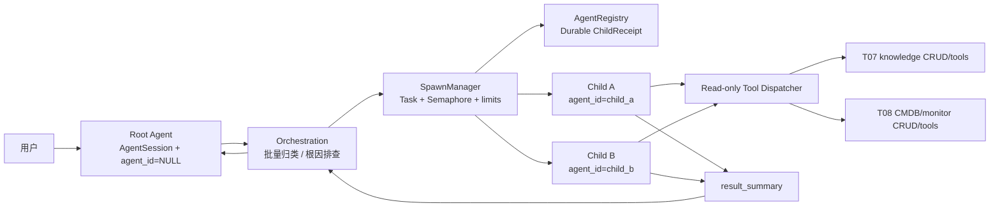

# T09 · Spawn 编排与角色目录设计

**状态：** 已确认

**日期：** 2026-08-11

**依赖：** T06 Agent 内核、T07 知识库、T08 CMDB + 监控

**对应架构：** `docs/AGENT_ARCHITECTURE.md` §4、§5、§10、§13–14

## 1. 目标

T09 为现有单 Agent 循环增加可审计的动态子 Agent 能力，交付以下完整闭环：

1. 进程内 `asyncio` Spawn 执行器；
2. 持久化 `ChildReceipt` 与完整生命周期；
3. root、child、siblings 之间的消息上下文隔离；
4. 五个只读角色及其最小工具白名单；
5. `spawn_agent`、`wait_agent`、`send_input`、`close_agent`、`list_agents` 五个原语；
6. 并发、深度、累计数量、步数、费用、墙钟时间等限额；
7. 批量文档归类与根因排查两个有界并行编排范式；
8. 启动孤儿回收、终态回执 GC、级联关闭和生命周期 trace；
9. 不依赖真实 LLM 或真实 PostgreSQL 的确定性测试套件。

## 2. 设计依据

主流多 Agent 实现虽然存储方式不同，但在三个原则上基本一致：

- 中央 supervisor/root 维护用户对话并决定委派；
- 子 Agent 使用独立上下文、角色指令和工具集合；
- 子 Agent 的中间工具噪声留在自身上下文，只把结构化结果返回父 Agent。

OpenAI Agents SDK 的嵌套 `Agent.as_tool()` 不会自动继承父运行的会话状态；只有调用方显式传入同一 session 才共享历史。Anthropic 的 Task/subagent 模式明确使用独立上下文、历史与工具。LangChain supervisor 模式同样把 clean context 和只回传结果作为主要价值。

本项目选择“共享用户会话 + 按 Agent 身份划分消息命名空间”，而不是为每个 child 创建伪 `AgentSession`：

- `AgentSession` 始终只代表用户可见会话；
- `AgentRegistry` 表示内部执行实例；
- `AgentMessage.agent_id` 表示该消息属于 root 还是某个 child；
- `(session_id, agent_id)` 是模型历史的精确作用域。

这与主流的“父任务统一关联、子上下文独立”一致，同时是对 T06 现有模型侵入最小的实现。

参考：

- [OpenAI Agents SDK · Agents as tools](https://openai.github.io/openai-agents-python/tools/)
- [Anthropic Claude Cookbook · Subagents via Task Tool](https://platform.claude.com/cookbook/claude-agent-sdk-01-the-chief-of-staff-agent)
- [LangChain · Subagents](https://docs.langchain.com/oss/python/langchain/multi-agent/subagents)
- [LangGraph · Subgraph namespace isolation](https://docs.langchain.com/oss/python/langgraph/use-subgraphs)

## 3. 范围边界

### 3.1 T09 包含

- 后端 Python 运行时、角色目录、工具调度、生命周期与编排函数；
- 为上下文、trace 与可靠 GC 所需的窄幅数据库扩展；
- 模型能力标记及按 token 单价计算的费用；
- 单进程内并发执行和恢复性清理；
- 使用 fake model/fake child runner 的单元与集成测试。

### 3.2 T09 不包含

- HTTP/WebSocket Chat 接入及前端展示；这些属于 T11；
- 知识分类结果自动写回、移动知识文件或修改 CMDB；T09 的 child 全部只读；
- `propose_remediation`、审批与真实设备动作；这些属于 T10；
- 新增 `query_audit_logs` 或 `query_cmdb_changes` 工具；
- Redis、消息队列、分布式锁、多进程执行器和跨主机恢复；
- 物理删除 ChildReceipt 或 transcript 的数据保留策略；GC 在 T09 只负责关闭和释放槽位。

## 4. 总体架构



边界规则：

- `SpawnManager` 是本进程中 child `asyncio.Task` 的唯一所有者；
- `AgentRegistry` 是生命周期与审计的持久化事实源；
- child 使用独立 `AsyncSession`，不得并发共享 root 请求的 session；
- Agent 工具只调用现有 CRUD/服务，不写原始 SQL；
- workflow 只组合 Spawn 原语，不持有底层 task 对象。

## 5. 数据模型扩展

### 5.1 `AgentMessage.agent_id`

新增可空 `String(36)`：

- `NULL`：root Agent 消息；
- child UUID：一个 child 的 user/assistant/tool 消息；
- 不加外键：即使未来清理 registry，历史仍保留原 Agent 身份；
- 增加 `(session_id, agent_id)` 复合索引。

`agent_message_crud.list_for_session()` 保持“列出整个会话所有消息”的审计语义；新增 `list_for_agent()` 供模型历史使用。现有调用不传 `agent_id` 时只构建 root 历史，保持向后兼容。

### 5.2 `AgentRegistry.trace_id`

新增非空 `String(36)`，同一 workflow 的全部 children 共用一个 trace ID：

- orchestration 未传入时生成 UUID；
- 单独调用 `spawn_agent` 时生成独立 trace；
- 启动回收和 GC 可继续写入同一 trace；
- `AgentTraceEvent` 可按一次用户任务关联多个 children。

### 5.3 `AgentRegistry.status_changed_at`

新增带时区时间戳，每次状态变化时更新：

- GC 使用它判断终态回执是否过期；
- 不使用 `created_at` 估算完成时间，避免长任务一完成就被误判为过期；
- `closed_at` 仍只在进入 `CLOSED` 时填写。

### 5.4 `AgentRegistry.force_closed` 与 `role_version`

新增非空字段：

- `force_closed: bool = false`：仅在 `close_agent` 取消超时后强制 detach 时置为 `true`；正常关闭、启动 reconciliation 和 GC 均保持 `false`；
- `role_version: String`：Spawn 时持久化角色目录版本（当前为 `t09-v1`），使历史 receipt 和 trace 可按当时的角色契约解释。

迁移时对旧 registry 行回填：`trace_id=child_id`、`status_changed_at=COALESCE(closed_at, created_at)`、`role_version='legacy'`、`force_closed=false`。旧 budget JSON 保留已有值，并为缺失键补齐 T09 默认的 `max_wall_time_seconds=120.0`、`steps_used=0`、`cost_used_usd=0.0`；既有 `max_steps`/`max_cost_usd` 缺失时分别补 `20`/`1.0`。回填后字段均为非空；不改写既有 role、工具参数或历史结果。

### 5.5 `AgentRegistry.budget`

继续使用现有 JSON 字段，契约固定为：

```json
{
  "max_steps": 20,
  "max_cost_usd": 1.0,
  "max_wall_time_seconds": 120.0,
  "steps_used": 4,
  "cost_used_usd": 0.0132
}
```

前三项在 Spawn 时确定；后两项在终态落盘。没有新增预算表，因为 T09 只需在同一 session 内通过 registry 聚合 child 预算。

### 5.6 `ChildReceipt`

Python 侧使用不可变 dataclass，将 ORM 行转换为稳定返回契约：

- `child_id`, `trace_id`, `session_id`, `parent_agent_id`, `agent_path`；
- `role`, `role_version`, `model`, `tools_allowlist`, `sandbox_mode`, `task_brief`；
- `budget`, `status`, `result_summary`, `artifacts`；
- `force_closed`, `created_at`, `status_changed_at`, `closed_at`。

调用方不直接持有 ORM 实例，避免 session 关闭后的延迟加载或意外修改。

## 6. 上下文隔离

`run_loop` 增加两个向后兼容的关键字参数：

- `agent_id: str | None = None`；
- `system_prompt: str | None = None`。

child 历史严格由以下内容组成：

1. 从角色目录取得并在每轮重新注入的 system prompt；
2. Spawn 时写入 child 消息空间的 `task_brief`；
3. 该 child 后续产生的 assistant/tool 消息；
4. `send_input` 写入该 child 的补充 user 消息。

child 看不到：

- root 的对话历史；
- 兄弟 child 的 task brief、工具输出或结论；
- 父 child 的完整 transcript。

父 Agent 需要的上下文必须显式放进 `task_brief`。这使 `fork_mode="none"` 成为数据库查询保证，而不只是 prompt 约定。

## 7. 角色目录

角色定义是不可变、版本化的代码配置：

| 角色 | 模型档位 | 工具 | 用途 |
| :--- | :--- | :--- | :--- |
| `classifier` | fast | `kb_glob`, `kb_grep`, `kb_read` | 两份及以上文档并行分类建议 |
| `kb_explorer` | fast | 四个知识工具 | 跨文档独立取证 |
| `ops_explorer` | fast | 三个 CMDB/监控工具 | 单一结构化数据源取证 |
| `investigator` | balanced | 全部七个只读工具 | 一个独立根因假设分支 |
| `reviewer` | reasoning | 全部七个只读工具 | 复核冲突并综合证据 |

所有角色当前默认 `local-chat`，因为 `MODELS` 只有一个 chat key。模型档位用于表达选择意图，不登记不存在的模型。调用方覆盖 `spawn_agent` 的 `model` 参数时，只能选择 `capability="chat"` 的已登记模型。

角色目录与工具 schema 均标记 `t09-v1`。修改 instructions、结构化输出或参数契约时必须升版本，确保历史 trace 和 Eval 可解释。

## 8. 工具调度与安全

`tool_dispatch.py` 为七个读工具定义精确 Pydantic 参数模型，并从模型生成 OpenAI-compatible JSON Schema。

调度顺序固定：

1. 工具名是否在该 child 的持久化 allowlist；
2. 工具名是否存在于代码注册表；
3. 参数是否通过 `extra="forbid"` 和字段边界校验；
4. 调用对应 T07/T08 函数；
5. 将异常转换为结构化 `ToolResult`。

控制信号：

- 不在白名单或未知工具：`rejected`；
- 缺参数、参数冲突或越界：`clarification`；
- 工具自身的业务结果：原样返回；
- 未处理执行异常：`failed`，只暴露异常类型，不暴露连接串、SQL 或密钥。

`control=failed` 只把安全的失败信息返回模型；只要仍有 step、费用和墙钟预算，模型可以据此修正参数、改用其他允许工具或直接给出最终答案。只有工具循环最终仍有未处理异常，或后续触发任一预算上限，才映射为 child 终态失败。

T07/T08 已交付工具的参数实现是本设计的规范来源；T09 只调用既有契约，不改写工具或另设平行参数。包括知识库的 `category_id`、监控/CMDB 查询的 `ip_prefix`、`since_limit` 等字段，均以现有实现为准。

白名单覆盖不能扩权：调用方传入的 `tools_allowlist` 必须是角色默认集合的子集。

## 9. Spawn 原语

### 9.1 `spawn_agent`

输入：`session_id`, `role`, `task_brief`, 可选 `trace_id`, `parent_agent_id`, `model`, `tools_allowlist`, `budget`, 固定 `fork_mode="none"`。

按顺序执行：

1. 校验 task brief 非空；
2. 校验角色、chat model、工具子集和 fork mode；
3. 校验父 child 属于同一 session 且尚未关闭；
4. 计算深度；root child 为 1，嵌套 reviewer 为 2；
5. 校验累计 child 数、session child 预算和 active 数；
6. 在 session 级锁内获取 `asyncio.BoundedSemaphore`；
7. 创建 REQUESTED registry、child task brief 和 spawn trace；
8. 流转到 SPAWNING 并提交；
9. 创建命名的 `asyncio.Task`；
10. 返回 ChildReceipt。

只有 `reviewer` 可以作为第二层 child；深度超过 2 或其他嵌套角色均在创建 registry 前拒绝。

### 9.2 `wait_agent`

- 本进程有 task：等待该 task，超时使用 `asyncio.shield`，不得因调用方等待超时而取消 child；
- registry 已在终态：直接返回持久化 receipt；
- registry 仍为 active、但本进程没有 task：返回 runtime-unavailable 错误，由启动 reconciliation 处理；
- `timeout_ms` 到期：抛出明确的 wait timeout，child 继续执行。

### 9.3 `send_input`

- 仅接受 `RUNNING` child；
- 持久化写入该 child 的 user 消息空间；
- child 在下一次构建模型历史时读取；
- 如果 child 已进入终态则拒绝，不自动重开生命周期。

该原语不用于两个内置 workflow 的主路径，避免把确定性编排变成运行中交互协议。

### 9.4 `close_agent`

- 幂等；
- 先按后代优先顺序关闭整棵子树；
- RUNNING task 先 cancel，并在有限时间内等待；
- 正常取消：`RUNNING → CANCELLED → CLOSED`；
- cancel 后以 `wait_for(shield(task), timeout)` 或等价的 deadline wait 等待，不能让吞掉 `CancelledError` 的 task 拖住 close deadline；
- task 不响应取消：先落 CANCELLED terminal trace，再强制 detach，registry 与 receipt 标注 `force_closed=true`；这是唯一可将该字段设为 `true` 的路径；
- 终态 child：直接进入 CLOSED；
- 最后且只释放一次 Semaphore 槽位。

### 9.5 `list_agents`

按 `created_at, child_id` 稳定返回一个 session 的全部 receipts，包括 CLOSED。它只查询 registry，不依赖 root 是否还记得 child ID。

## 10. 生命周期与并发

```text
REQUESTED → SPAWNING → RUNNING → COMPLETED | FAILED | CANCELLED → CLOSED
```

规则：

- `COMPLETED`、`FAILED`、`CANCELLED` 都仍是 active receipt，继续占槽；
- 显式 close、启动 reconciliation 或 GC 才能进入 CLOSED；
- 同一 session 默认最多 5 个非 CLOSED children；
- session 级 `asyncio.Lock` 串行化“检查配额 + 获取槽 + 建 registry”，防止并发超发；
- `BoundedSemaphore` 防止重复释放；
- manager 额外记录本进程实际持有槽位的 child IDs，关闭外部遗留 row 时不会错误 release；
- 对大于 5 的批量任务，workflow 分波执行，而不是让第六次 Spawn 无限等待。

## 11. 预算

### 11.1 配置

建议默认值：

| 配置 | 默认值 |
| :--- | :--- |
| `AGENT_MAX_CONCURRENT_CHILDREN` | 5 |
| `AGENT_MAX_SPAWN_DEPTH` | 2 |
| `AGENT_MAX_CHILDREN_PER_SESSION` | 50 |
| `AGENT_MAX_TOTAL_CHILD_COST_USD` | 5.0 |
| `AGENT_CHILD_MAX_STEPS` | 20 |
| `AGENT_CHILD_MAX_COST_USD` | 1.0 |
| `AGENT_CHILD_MAX_WALL_TIME_SECONDS` | 120.0 |
| `AGENT_CLOSE_TIMEOUT_SECONDS` | 5.0 |
| `AGENT_TERMINAL_RECEIPT_TTL_SECONDS` | 300.0 |
| `AGENT_RECEIPT_GC_INTERVAL_SECONDS` | 60.0 |

调用方的 child budget override 只能收紧上述单 child 上限：steps 至少 1、cost 为 finite 且非负、wall time 为 finite 且大于 0，并且初始 usage 必须为零。非法 override 在 receipt 创建前拒绝。

### 11.2 模型费用

`ModelConfig` 增加：

- `capability: "chat" | "embedding"`；
- `input_cost_per_million_usd`；
- `output_cost_per_million_usd`。

`chat()` 根据响应 usage 计算 `ChatResult.cost_usd`。本地模型价格默认 0；付费模型价格由 `.env` 明确配置，不在代码中写易过期的厂商价格。

`Budget` 在模型调用前预留 step，在响应后记录费用。响应已经产生的成本无法撤销；若本次响应使费用越限但已包含 final answer，保留该结果并以 `COMPLETED` 结束。若响应包含 `tool_calls`，禁止执行任何工具并以 `FAILED/policy_reject` 结束；其余越限情形同样停止后续模型/工具循环。

### 11.3 session child 预算

Spawn 时采用保守预留：

- active child 按剩余 `max_cost_usd` 计入预留；
- terminal/closed child 按已落盘 `cost_used_usd` 计入已用；
- 已用 + active 预留 + 新 child 上限不得超过 `AGENT_MAX_TOTAL_CHILD_COST_USD`。

T09 的总额只覆盖 spawned children。root 自身的跨轮累计费用需要用户 Chat 入口定义一次“会话轮次”边界，随 T11 的 root runner 接入统一账本；T09 不伪造尚不存在的 root 持久化费用来源。

## 12. Child 执行

每个 child task：

1. 创建独立 `AsyncSession`；
2. 读取 registry 和角色定义；
3. `SPAWNING → RUNNING` 并提交；
4. 构建角色专属 dispatcher 与 tool schemas；
5. 在 `asyncio.timeout(max_wall_time_seconds)` 内调用 scoped `run_loop`；
6. 将 outcome 映射为终态；
7. 落盘 result summary、实际步数/费用和 terminal trace；
8. 提交后退出 task，但不释放 slot。

映射规则：

| 结果 | 状态 | error_class |
| :--- | :--- | :--- |
| final answer | `COMPLETED` | 空 |
| step/cost/wall-time 超限 | `FAILED` | `policy_reject` |
| tool `rejected`/`clarification`/`pending_approval` early exit | `FAILED` | `policy_reject` |
| model 请求异常 | `FAILED` | `model` |
| 工具循环最终未处理异常 | `FAILED` | `tool` |
| DB/task/runtime 异常 | `FAILED` | `infra` |
| close/shutdown 取消 | `CANCELLED` | 空 |

异常路径先 rollback 失败 transaction，再用新 session 写终态，确保一个失败的工具/数据库 transaction 不阻止 ChildReceipt 结束。

## 13. 编排范式一：批量文档归类

入口只接受两份及以上文档；单文档分类直接拒绝 Spawn，落实架构反模式红线。

输入项：

- `document_id`, `title`, `file_path`, `current_category`；
- 可选分类集合 `allowed_categories`；
- 不把正文复制进 task brief，classifier 用 `kb_read` 读取授权文件。

执行：

1. 以最多 5 个为一波，为每份文档 Spawn 一个 classifier；
2. 并行 wait 当前波；
3. 在 `finally` 中 close 当前波全部 children；
4. 严格解析每个分类 JSON；
5. 收集低置信度（`confidence < 0.80`）、`needs_review=true`、新分类建议、解析失败或 child 失败；
6. 没有问题时直接返回建议；
7. 有问题时 Spawn 一个 reviewer，输入只包含分类摘要、冲突和证据路径；
8. wait + close reviewer；
9. 返回分类建议、失败 child IDs 和复核结论。

close 会尝试当前波全部 children；任一 close 失败必须产生显式 workflow cleanup failure，不能吞掉异常后返回成功。

classifier 输出：

```json
{
  "document_id": 42,
  "recommended_category": "network_sop",
  "confidence": 0.91,
  "needs_review": false,
  "reason": "正文包含交换机升级、回滚和验证步骤"
}
```

该 workflow 不更新 `KnowledgeDocument.category_id`，也不移动文件。调用方必须把结果作为建议展示或交给明确的写入 API。

## 14. 编排范式二：根因排查

入口要求至少两个独立分支；默认提供三个与现有工具能力一致的分支：

1. `monitor_history`：检查当前状态、最近事件和是否存在同时抖动；
2. `cmdb_topology`：检查资产归属、位置、业务系统和依赖拓扑；
3. `peer_scope`：检查同网段或同依赖范围设备是否同时异常。

架构图中的“CMDB 最近变更”目前没有 Agent 工具。investigator 必须把它列为 evidence gap，不能直接查询 `audit_logs` 或写原始 SQL。

执行：

1. 为每个分支 Spawn 一个 investigator；
2. 有界并行 wait；
3. 在 `finally` 中 close 所有 investigators；
4. 严格解析分支 JSON；
5. 至少一个分支成功时 Spawn reviewer；
6. reviewer 检查证据矛盾、相关性/因果混淆和缺失证据，生成综合 JSON；
7. wait + close reviewer；
8. 返回 findings、synthesis、失败 child IDs 和 evidence gaps；
9. 所有分支失败时不浪费 reviewer 调用，返回明确的 workflow failure。

该范式沿用相同 cleanup 契约：尝试关闭全部已 Spawn children，任一 close 失败都禁止成功返回。

investigator 输出：

```json
{
  "branch": "monitor_history",
  "hypothesis": "三个机房共享上游链路发生抖动",
  "confidence": 0.64,
  "evidence": ["三个目标在相近时间由 up 变为 down"],
  "gaps": ["缺少链路设备变更日志"],
  "next_checks": ["核对三处资产的上游依赖是否收敛到同一节点"]
}
```

reviewer 输出：

```json
{
  "summary": "现有证据更支持共享上游故障，但尚不能确认具体变更",
  "likely_causes": ["共享上游链路或核心设备异常"],
  "evidence_gaps": ["CMDB/网络设备变更日志不可通过当前工具查询"],
  "recommended_next_steps": ["人工核对变更平台并检查共同上游设备"]
}
```

root 根据该结构化结果生成用户最终回答；reviewer 不直接面向用户，也不创建处置提案。

## 15. 回收、重启与关闭

### 15.1 启动 reconciliation

应用启动、接受 Chat 请求前执行一次：

- `REQUESTED`/`SPAWNING`/`RUNNING` 且本进程没有 task：先标记 CANCELLED，再 CLOSED；
- terminal 但未 CLOSED：直接 CLOSED；
- 不改写 `result_summary`；强制关闭原因写入 `close` trace 的结构化控制/错误字段，避免破坏 child 严格 JSON 输出；
- 写 `close` trace；
- 不释放本进程 semaphore，因为这些 rows 从未在本 manager 中取得槽位。

这是一种单进程 crash recovery，不尝试从中间模型调用恢复执行。

### 15.2 终态 GC

后台循环按 `AGENT_RECEIPT_GC_INTERVAL_SECONDS` 扫描：

- 只处理 terminal 且 `status_changed_at` 超过 TTL 的 rows；
- 幂等调用 close；
- 保留 registry 和 transcript；
- 释放本进程确实持有的槽位。

### 15.3 应用关闭

FastAPI lifespan：

1. 取消 monitor、CMDB diff、receipt GC 后台循环；
2. `SpawnManager.shutdown()` 级联取消并关闭本进程 children；
3. 最后 dispose database engine。

部署约束为一个 Agent executor worker。多个 Uvicorn workers 会各自持有不共享的 task/semaphore，T09 不宣称支持这种模式。

## 16. 可观测性

每个 workflow 生成一个 trace ID，生命周期至少记录：

- `spawn`：角色、parent、ChildReceipt 已创建；
- `agent`：COMPLETED/FAILED/CANCELLED、费用、error class；
- `close`：正常关闭、级联、GC 或 force detach。

沿用 `AgentTraceEvent` 固定错误分类：`model | tool | policy_reject | infra`。同一 `step` 内的 trace 固定按 `step, created_at, id` 排序，保证并发下的历史回放稳定。`result_summary` 只保存回传父上下文的正文；内部异常详情写服务日志，不进入模型上下文。

工具级和 generation 级完整瀑布 trace 可在 root Chat 入口接入时扩充；T09 必须先保证 child 生命周期、费用和失败类别可审计。

## 17. 测试策略

所有自动化测试不访问真实 LLM、不访问本地 embedding 服务、不要求 Docker PostgreSQL。

### 17.1 单元测试

- root/child/sibling 消息完全隔离；
- system prompt 由代码注入；
- 模型 capability 与 token 费用计算；
- 五角色、档位、说明和精确 allowlist；
- 七工具 JSON Schema、参数边界和 fail-closed 调度；
- ChildReceipt ORM 转换、`role_version` 与 `force_closed=false` 默认值；
- legacy registry 回填 `trace_id=child_id`、`status_changed_at=COALESCE(closed_at, created_at)`、`role_version='legacy'`、`force_closed=false`；
- 合法/非法生命周期流转；
- 模型计费越限时 final answer 保留、含 `tool_calls` 禁止执行并 `policy_reject`，以及 `control=failed` 在剩余预算内可纠错；
- model/tool/policy/infra 失败映射与同 step trace 的 `step, created_at, id` 排序。

### 17.2 并发与生命周期测试

- fake runner 通过 `asyncio.Event` 证明两个 children 同时 RUNNING；
- 第六个 active child 被拒绝而非无限等待；
- COMPLETED 未 close 仍占槽；
- close 后槽位可重新使用且只释放一次；
- 强制 detach 是 `force_closed=true` 的唯一来源；
- 吞掉取消的 task 仍在 close deadline 后被 force detach，晚到结果不能覆盖 CLOSED；
- wait timeout 不取消 child；
- wall-time 超限只失败当前 child；
- depth 2 可用，depth 3 被拒绝；
- 关闭父 child 后代优先级联 CLOSED；
- 启动 reconciliation 回收孤儿；
- GC 只关闭超过 TTL 的 terminal receipt。

### 17.3 Workflow 测试

- 单文档分类拒绝 Spawn；
- 两份文档并行分类，无问题不调用 reviewer；
- 新分类、`confidence < 0.80`、解析失败或 child failure 触发 reviewer；
- 大批量按五个一波执行且无 active receipt 泄漏；
- 根因分支并行并由 reviewer 综合；
- 全部分支失败时返回 workflow failure；
- 严格 JSON 解析失败绝不静默通过。
- 任一 workflow close 失败仍继续关闭兄弟，并返回显式 cleanup failure 而非成功；

### 17.4 跨组件不变量测试

使用真实 SQLite ORM、真实 SpawnManager 和注入 fake ChatFn 的默认 child runner 执行两个 workflow（纯 manager 故障单测可注入 fake ChildRunner），验证：

- registry 最终全部 CLOSED；
- `list_active_children()` 为空；
- root 历史不包含 child task 或结果；
- 每个 child 只能读取自己的 task brief；
- 每个 receipt 有 spawn、terminal、close trace；
- 预算 usage 已落盘。

最终执行完整 pytest、mypy strict 和 ruff；Alembic 只检查单一 head，不连接用户的 Docker 测试库。

## 18. 失败处理原则

- 先拒绝再分配：角色、模型、工具、深度、数量、预算错误不创建 receipt；
- 已创建必终结：一旦 registry 建立，所有异常路径必须进入 terminal 或 CLOSED；
- sibling 隔离：一个 child 失败不取消兄弟，workflow 决定能否用部分结果继续；
- close 必在 `finally`：workflow 解析失败、reviewer 失败或调用方取消都不泄漏槽位；
- parse failure 是数据：保留原摘要的安全截断，标记复核/失败，不伪造成结构化成功；
- 只读优先：即使 force detach 后 coroutine 短暂未退出，也没有写生产数据的能力。

## 19. 已确认决策

1. 采用方案 1：一个用户 `AgentSession`，消息以 nullable `agent_id` 隔离；
2. T09 包含真实模型成本计量、墙钟超时、孤儿回收和终态 GC；
3. 使用进程内 `asyncio`，不引入新中间件；
4. children 全部只读；分类和根因结果只作为建议；
5. 当前所有角色默认 `local-chat`，不虚构未登记模型；
6. 根因默认分支只使用当前七个工具可取得的证据；
7. T07/T08 已实现的工具及其参数（包括 `category_id`、`ip_prefix`、`since_limit`）是规范来源，T09 不擅改已交付工具；
8. classifier 的低置信阈值固定为 `0.80`；
9. 自动化验收不调用用户的真实模型、embedding 或 Docker PostgreSQL。

## 20. 验收标准

T09 完成需同时满足：

- 五个 Spawn 原语有确定的类型、错误和测试；
- `fork_mode="none"` 由数据库查询作用域保证；
- 同 session 默认最多五个 active children，终态未 close 仍占槽；
- 最大深度 2，只有 reviewer 可嵌套；
- ChildReceipt 在断线、root 上下文丢失和进程重启后仍可查询；
- registry 与 receipt 持久化 `role_version`、`force_closed`，旧行按既定 backfill 规则可解释；
- batch classification 与 root-cause workflow 都能并行、严格解析、部分失败隔离并最终关闭全部 children；
- 预算至少覆盖 steps、child token cost、wall time、session child allocation；
- 费用越限时 final answer 可完成、含 `tool_calls` 不执行工具并以 `policy_reject` 失败；`control=failed` 可在剩余预算内由模型纠错；
- trace 同 step 的查询顺序为 `step, created_at, id`，分类 `confidence < 0.80` 必须触发 reviewer；
- startup reconciliation、GC、cascade close 不泄漏槽位；
- 全量 pytest、mypy、ruff 通过；
- 不需要真实外部服务即可重复验收。
