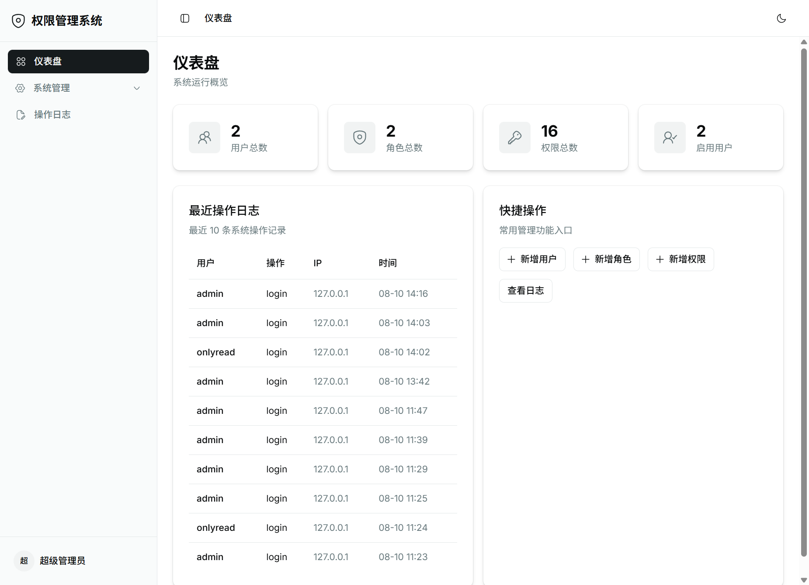

# 前端 — fastapi-admin

[English](./README.md) · [根目录说明](../README_zh.md)

RBAC 管理后台的 React SPA：登录、仪表盘、用户/角色/权限、操作日志、个人中心，以及**运维助手** Chat（会话列表、WebSocket 实时事件、HITL 审批卡、知识库上传）。



架构与 WS 契约见 [docs/AGENT_ARCHITECTURE.md](../docs/AGENT_ARCHITECTURE.md)。

## 技术栈

- React **19** + TypeScript + Vite **8**
- Tailwind CSS **4** + shadcn/ui（**Base UI** / `@base-ui/react`）
- Hugeicons（经 `@/lib/icons`）、TanStack Table、React Hook Form + Zod
- Zustand 认证状态、React Router **7**、Axios
- Vitest（WS envelope / chat reducer 等纯函数）
- 启动时通过 refresh Cookie 恢复会话

## 目录结构

```text
frontend/
├── src/
│   ├── components/
│   │   ├── layout/           # Sidebar、PageHeader
│   │   ├── ops-assistant/    # Chat UI、HITL 卡、知识上传、监控告警条
│   │   └── ui/               # shadcn 组件
│   ├── hooks/                # useAuth、usePermission、useAgentWs、useOpsChat
│   ├── lib/                  # api、agent-api、agent-ws、hitl-api、knowledge-api、常量、图标
│   ├── pages/                # 含 OpsAssistantPage（/ops-assistant）
│   ├── store/                # Zustand
│   └── types/
├── vite.config.ts            # 开发态 /api（含 WS）代理到后端
├── .env.example
└── package.json
```

## 环境准备

```bash
cd frontend
cp .env.example .env
pnpm install   # 或 npm install
```

`.env`：

```ini
VITE_API_BASE_URL=http://localhost:8000/api/v1
```

请确保后端已启动，且 CORS 包含 `http://localhost:5173`。

开发时 `vite.config.ts` 会把 `/api`（含 WebSocket upgrade）代理到 `http://127.0.0.1:8000`，因此本地也可用相对路径连 WS，避免跨域。

## 常用脚本

```bash
pnpm run dev         # http://localhost:5173
pnpm run build       # tsc -b && vite build
pnpm run typecheck   # tsc -b --force
pnpm run test        # vitest run
pnpm run lint
pnpm run preview
```

## 运维助手（`/ops-assistant`）

- 侧栏「运维助手」：登录即可见（无额外权限码）
- 会话 REST：`/agent/sessions`；发消息 `POST .../messages`（超时约 300s，因可能跑完整 Agent turn）
- WebSocket：`/api/v1/ws/agent/{session_id}?access_token=...`，承载 `assistant_delta` / `tool_call` / `hitl_*` / `monitor_alert` / `error` 等；断线指数退避重连（上限 30s），恢复后不自动重放进行中的 turn
- **HITL**：WS 只含安全摘要；有 `agent:hitl_approve` 时再 HTTP 拉完整 payload，并调用 `/hitl/proposals/{id}/decide`
- **知识上传**：按钮需 `knowledge:upload`；分类列表需 `knowledge:read`（仅有 upload 无 read 时会提示，不会白屏）

相关实现：`pages/OpsAssistantPage.tsx`、`hooks/use-ops-chat.ts`、`hooks/use-agent-ws.ts`、`components/ops-assistant/*`。

## 认证与权限（前端）

- access token 存放于内存；refresh token 使用 HttpOnly Cookie
- 启动时 `bootstrap()` 单飞刷新一次会话，再请求 `/me`
- 菜单与操作按钮使用 `src/lib/constants.ts` 中的 `PERMISSIONS` / `ROUTES`
- 超管在前端绕过权限展示限制；真正鉴权仍在后端接口完成

权限码与后端种子一致（含 `knowledge:*`、`cmdb:*`、`monitor:*`、`agent:hitl_approve`）。

## 截图

完整界面预览见 [根目录 README](../README_zh.md#界面预览)（`docs/images/`）。

## 说明

- 组件遵循已安装的 shadcn Base UI 用法（按需使用 `render=`，而非 Radix 的 `asChild`）
- 表单建议使用 registry 的 `field` 组件，以便正确展示校验错误
- 图标统一从 `@/lib/icons` 引入，不要直接散落 `@hugeicons/...`
- 颜色/字体走语义 token；布局用 flex + gap，避免装饰性卡片堆叠
